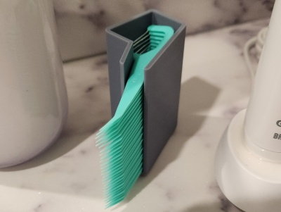
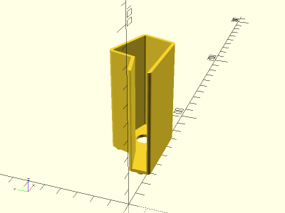

# Flosser Holder

<table>
<tr>
<td></td>
<td></td>
</tr>
</table>

A flosser holder for CVS Health brand "Advanced Floss Picks". Made with OpenSCAD.

**Design:** [flosser_holder.scad](flosser_holder.scad)

**STL:** [flosser_holder.stl](stl/flosser_holder.stl)

**Recommended Print Settings:** PLA+, 0.20mm layer height, 100% infill, supports on build plate if riser pegs are enabled

**Thingiverse:** https://www.thingiverse.com/thing:6085461

**License**: 
